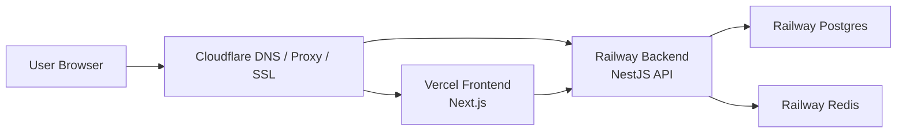

# Thong Thai Space - Production Deployment Design

## 1. Muc tieu

Tai lieu nay mo ta thiet ke production cho du an Thong Thai Space voi mo hinh:

- Frontend: Vercel
- Backend API: Railway
- PostgreSQL: Railway Postgres
- Redis: Railway Redis
- DNS / SSL / Proxy: Cloudflare

Muc tieu cua mo hinh nay:

- Tach rieng frontend va backend de de scale va de van hanh
- Toi uu deploy cho Next.js bang Vercel
- Toi uu deploy cho NestJS + Prisma bang Railway
- Quan ly domain, SSL, DNS va bao ve edge bang Cloudflare
- Ho tro auth bang HttpOnly cookies, CORS an toan, WebSocket, file upload va health check

## 2. Kien truc tong the



## 3. Domain va naming de xuat

| Thanh phan | Domain de xuat | Ghi chu |
| --- | --- | --- |
| Website frontend | `thongthaispace.com` | Trang public + dashboard/client portal |
| WWW redirect | `www.thongthaispace.com` | Redirect ve root domain |
| Backend API | `api.thongthaispace.com` | REST API + uploads + health |
| Socket endpoint | `api.thongthaispace.com/socket.io` | Dung chung domain backend |
| File uploads | `api.thongthaispace.com/uploads/...` | Neu chua tach object storage |

## 4. Phan bo trach nhiem theo nen tang

### 4.1 Vercel

Vercel phu trach:

- Build va host ung dung Next.js App Router
- CDN cho static assets frontend
- Preview deploy theo branch / pull request
- Tu dong deploy khi push len branch production
- SSL cho frontend domain neu tro truc tiep qua Vercel hoac qua Cloudflare DNS only

Frontend dang su dung:

- Next.js
- React 19
- React Query
- Axios
- Socket.IO client

Yeu cau frontend production:

- `NEXT_PUBLIC_API_URL` phai tro toi `https://api.thongthaispace.com/api`
- `NEXT_PUBLIC_SOCKET_URL` phai tro toi `https://api.thongthaispace.com`
- Vercel project phai root vao thu muc `frontend/`

### 4.2 Railway Backend

Railway phu trach:

- Chay service NestJS backend
- Chay Prisma voi PostgreSQL adapter pattern
- Ket noi Railway Postgres va Railway Redis
- Expose health endpoints
- Tu dong deploy tu GitHub

Backend dang su dung:

- NestJS 11
- Prisma 7
- PostgreSQL 16
- Redis 7
- JWT bang HttpOnly cookies
- Socket.IO

Yeu cau backend production:

- Railway service root vao thu muc `backend/`
- Dockerfile production phai copy du `prisma`, `prisma.config.ts`
- Startup command phai chay `prisma migrate deploy` truoc khi boot app
- `FRONTEND_URL` phai trung domain frontend production

### 4.3 Railway Postgres

Railway Postgres phu trach:

- Luu tru toan bo du lieu chinh cua he thong
- Quan ly migration Prisma
- Backup va restore theo chinh sach cua Railway hoac backup ngoai

Yeu cau:

- `DATABASE_URL` dung connection string Railway cung cap
- Migrations phai duoc commit day du vao git
- Khong duoc de `_prisma_migrations` trong trang o production sau deploy dau tien

### 4.4 Railway Redis

Railway Redis phu trach:

- Cache / queue / session helper neu duoc su dung
- Ho tro notification / realtime / token / cache tang toc

Yeu cau:

- `REDIS_URL` dung private connection string do Railway cung cap
- Kiem soat memory limit va eviction policy khi traffic tang

### 4.5 Cloudflare

Cloudflare phu trach:

- Quan ly DNS cho `thongthaispace.com` va subdomains
- SSL/TLS edge
- Optional proxy / WAF / bot protection / rate limiting / caching
- Chuyen huong domain va bao ve edge layer

Khuyen nghi:

- `thongthaispace.com` CNAME hoac A record theo huong dan Vercel
- `api.thongthaispace.com` CNAME toi Railway generated domain
- SSL mode: `Full (strict)`
- Bat `Always Use HTTPS`
- Bat Auto Minify neu khong xung dot
- Khong cache `/api/*`, `/socket.io/*`, `/uploads/*`

## 5. Luong request production

### 5.1 Public website

1. Nguoi dung truy cap `https://thongthaispace.com`
2. Cloudflare resolve DNS
3. Request duoc dua toi Vercel frontend
4. Frontend goi API den `https://api.thongthaispace.com/api`
5. Backend xu ly business logic va truy cap DB / Redis

### 5.2 Login va auth cookie

1. Frontend goi `POST /api/auth/login`
2. Backend tra HttpOnly cookies access / refresh theo chinh sach hien tai
3. Frontend goi `GET /api/auth/me` de lay profile
4. Khi access token het han, frontend thu refresh qua `/api/auth/refresh`
5. Neu refresh that bai va user dang o protected routes, frontend moi redirect ve `/login`

### 5.3 WebSocket / notification

1. Frontend mo ket noi den `https://api.thongthaispace.com/socket.io`
2. Cloudflare pass through toi Railway backend
3. Backend xac thuc va join room theo user
4. Event notification duoc push theo room

## 6. Bien moi truong production

### 6.1 Frontend tren Vercel

| Bien | Gia tri de xuat | Muc dich |
| --- | --- | --- |
| `NEXT_PUBLIC_API_URL` | `https://api.thongthaispace.com/api` | Base URL cho Axios |
| `NEXT_PUBLIC_SOCKET_URL` | `https://api.thongthaispace.com` | Socket.IO endpoint |

### 6.2 Backend tren Railway

| Bien | Gia tri | Muc dich |
| --- | --- | --- |
| `NODE_ENV` | `production` | Bat che do production |
| `PORT` | `4000` hoac Railway assigned | Cong app |
| `DATABASE_URL` | Railway Postgres URL | Prisma datasource |
| `REDIS_URL` | Railway Redis URL | Cache / redis client |
| `FRONTEND_URL` | `https://thongthaispace.com` | CORS |
| `JWT_SECRET` | secret manh >= 32 ky tu | Access token signing |
| `JWT_REFRESH_SECRET` | secret manh >= 32 ky tu | Refresh token signing |
| `JWT_EXPIRES_IN` | `15m` | Access token TTL |
| `JWT_REFRESH_EXPIRES_IN` | `7d` | Refresh token TTL |
| `ANTHROPIC_API_KEY` | secret that | AI service |
| `R2_*` | tuy chon | Neu tach file storage |
| `RESEND_API_KEY` | tuy chon | Email service |

## 7. Chien luoc build va deploy

### 7.1 Frontend Vercel

- Root directory: `frontend`
- Install command: `pnpm install`
- Build command: `pnpm build`
- Output: Next.js managed boi Vercel

Khuyen nghi:

- Bat Production Branch la `main`
- Preview deploy cho cac branch feature
- Gan domain `thongthaispace.com` vao project frontend

### 7.2 Backend Railway

- Root directory: `backend`
- Docker build tu `backend/Dockerfile`
- Startup command thuc te trong image:

```sh
node_modules/.bin/prisma migrate deploy && node dist/src/main.js
```

Khuyen nghi:

- Gan custom domain `api.thongthaispace.com`
- Healthcheck duong dan: `/api/health/live`
- Restart policy: on failure
- Theo doi logs startup de dam bao migration duoc apply

## 8. Prisma va migration strategy

Nguyen tac bat buoc:

- Tat ca migration trong `backend/prisma/migrations/` phai duoc commit len git
- Production khong duoc dung `prisma migrate dev`
- Production chi dung `prisma migrate deploy`
- Moi thay doi schema phai di kem migration file

Kiem tra deploy thanh cong:

- Log co dong `Applying migration ...` hoac `No pending migrations to apply`
- Bang `_prisma_migrations` co du lieu
- Cac bang nhu `users`, `projects`, `site_contents` ton tai

## 9. Bao mat production

### 9.1 Auth

- Su dung HttpOnly cookies cho token
- Frontend va backend bat buoc dung HTTPS
- `FRONTEND_URL` va CORS chi cho phep domain production hop le
- Refresh flow chi redirect ve login tren protected routes

### 9.2 Secrets

- Khong commit `.env.production`
- Quan ly secrets bang Railway Variables va Vercel Environment Variables
- Rotate `JWT_SECRET`, `JWT_REFRESH_SECRET`, API keys dinh ky

### 9.3 Edge / domain

- Cloudflare SSL `Full (strict)`
- Bat WAF / Bot Fight / rate limiting cho API neu can
- Rate limit manh hon cho cac route auth / contact / AI

## 10. Monitoring va healthcheck

### 10.1 Frontend

- Frontend health endpoint: `/api/health`
- Kiem tra page load: `/`

### 10.2 Backend

- Liveness: `/api/health/live`
- Readiness: `/api/health/ready`

### 10.3 Canh bao toi thieu

- Website down
- API down
- Readiness fail
- Error rate tang dot bien
- Railway DB storage / memory cao
- Redis memory cao

## 11. File upload strategy

Hien tai he thong ho tro `/uploads` tren backend. Co 2 huong:

### Phuong an tam thoi

- Upload vao backend filesystem
- Phu hop giai doan dau, demo, MVP

Rui ro:

- Deployment moi co the mat file neu filesystem ephemereal
- Kho scale ngang

### Phuong an khuyen nghi

- Chuyen file sang object storage nhu Cloudflare R2
- Backend chi luu metadata / URL public

## 12. Rollback strategy

### Frontend

- Vercel cho rollback sang deployment truoc
- Neu co bug giao dien, rollback gan nhu ngay lap tuc

### Backend

- Railway redeploy commit / image truoc do
- Khong rollback migration theo cach thu cong neu da co data moi, tru khi co ke hoach ro rang

### Database

- Luon co backup truoc migration lon
- Restore chi thuc hien tren maintenance window neu can

## 13. Checklist go-live rut gon

1. Commit day du source code va migrations
2. Verify Vercel env vars frontend
3. Verify Railway env vars backend
4. Verify custom domains o Cloudflare
5. Deploy backend va xac nhan migration da chay
6. Deploy frontend va test auth flow
7. Test dashboard, member, portal routing
8. Test uploads, websocket, content management
9. Test owner/admin account
10. Bat monitoring va canh bao

## 14. Rui ro da biet va luu y quan trong

| Rui ro | Mo ta | Huong xu ly |
| --- | --- | --- |
| Migration bi thieu trong deploy artifact | DB production trong, app 500 | Commit migration + fail fast trong Docker image |
| Redirect loop login | Frontend redirect sai tren auth/public pages | Chi redirect o protected routes, exclude `/auth/me` khoi refresh flow |
| Content schema lech | Visual editor mot so tab bi vo form | Normalize du lieu theo schema mac dinh |
| Uploads luu local | Co nguy co mat file khi redeploy | Uu tien chuyen sang R2 |

## 15. Khuyen nghi tiep theo

1. Tao `frontend/.env.production.example` de dong bo voi backend
2. Chuyen uploads sang Cloudflare R2
3. Bat sentry / log aggregation cho frontend va backend
4. Tach moi truong staging rieng: `staging.thongthaispace.com` va `api-staging...`
5. Tu dong smoke test sau deploy bang GitHub Actions hoac Railway/Vercel hooks